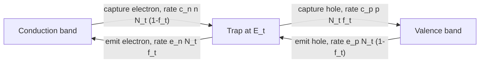

# 6 — Generation–recombination

## Learning objectives

- Derive the Shockley–Read–Hall (SRH) recombination kernel from a
  rate-equation model with a single trap level.
- Identify the four parameters $\tau_n, \tau_p, E_t, n_i$ in the kernel
  and recognize them in the schema and in `semi/physics/recombination.py`.
- Show that $R = 0$ at thermal equilibrium for any choice of $E_t$.
- Predict the asymptotics of SRH in the high-injection limit
  (Auger-relevant) and the strong-depletion limit (generation in
  reverse-biased junctions).
- Anticipate the Auger and band-to-band tunneling extensions in
  M16.3 / M16.6 (planned).

## Physical motivation

A semiconductor in the dark and at thermal equilibrium has a
steady-state population of electrons in the conduction band and holes
in the valence band, generated thermally (an electron is kicked across
the gap by a phonon or photon) and recombined back at the same average
rate. Under bias, the equilibrium balance is broken: a forward-biased
junction injects excess minority carriers that recombine; a
reverse-biased junction depletes the carriers in the space-charge
region and generation dominates locally.

The drift-diffusion equations capture all of this through a single
**net recombination rate** $R$ that appears in the continuity equations
(5.6). Modeling $R$ correctly is what distinguishes a useful device
simulator from a textbook toy. The shipped engine implements only the
SRH mechanism; M16.3 will add Auger, and M16.6 will add band-to-band
and trap-assisted tunneling. This chapter builds SRH from scratch and
forward-references the others.

## Derivation from first principles

### SRH model

Shockley, Read, and Hall (1952) modeled recombination as a two-step
process through an intermediate trap state at energy $E_t$ in the gap.
Four elementary processes are possible at each trap (Fig. 6.1):

Let $N_t$ be the density of trap states and $f_t$ the fraction
occupied by an electron. The rate equation for $f_t$ is

$$
\frac{df_t}{dt} = c_n n (1 - f_t) - e_n f_t - c_p p f_t + e_p (1 - f_t).
\tag{6.1}
$$

In steady state $df_t/dt = 0$:

$$
f_t = \frac{c_n n + e_p}{c_n n + e_p + c_p p + e_n}.
\tag{6.2}
$$

The net rate at which electrons leave the conduction band (and holes
leave the valence band) equals the *net* of the two electron processes:

$$
R = c_n n (1 - f_t) - e_n f_t = c_p p f_t - e_p (1 - f_t).
\tag{6.3}
$$

Equality of the two expressions in (6.3) is the definition of
steady-state SRH: the trap occupancy is whatever value makes electron
in/out and hole in/out balance simultaneously.

### Detailed balance: emission rates

At thermal equilibrium, the principle of detailed balance pins
$e_n / c_n$ and $e_p / c_p$ to known equilibrium quantities. Using
$f_t^\mathrm{eq} = 1/(1 + \exp((E_t - E_F)/kT))$ for the trap occupancy
and the equilibrium relations $n = n_i\exp((E_F - E_i)/kT)$,
$p = n_i\exp((E_i - E_F)/kT)$, one finds

$$
\frac{e_n}{c_n} = n_i\,e^{(E_t - E_i)/kT} \equiv n_1,
\qquad
\frac{e_p}{c_p} = n_i\,e^{(E_i - E_t)/kT} \equiv p_1.
\tag{6.4}
$$

So $n_1 p_1 = n_i^2$ for any trap level $E_t$.

### Substitute and simplify

Define the **lifetimes**
$\tau_n = 1/(c_n N_t)$, $\tau_p = 1/(c_p N_t)$. Substituting (6.4) into
(6.3) and combining with (6.2), after several lines of algebra (full
derivation in Appendix B §B.2), the trap occupancy drops out and one
gets

$$
R_\mathrm{SRH}(n, p)
   = \frac{n p - n_i^2}{\tau_p (n + n_1) + \tau_n (p + p_1)}.
\tag{6.5}
$$

with $n_1 = n_i\exp(E_t/V_t)$, $p_1 = n_i\exp(-E_t/V_t)$ measured from
the intrinsic level. For a mid-gap trap ($E_t = 0$ in the engine's
convention), $n_1 = p_1 = n_i$ and the expression simplifies further.

### Equilibrium $R = 0$

At thermal equilibrium $n p = n_i^2$ (mass action, 3.8), so the
numerator of (6.5) vanishes identically: $R = 0$ regardless of trap
level. This is consistent: at equilibrium net recombination is zero by
definition; what (6.5) enforces is the *deviation* from equilibrium,
weighted by the carrier-availability denominator.

### Asymptotic limits

**Low injection in n-type bulk** ($n \approx N_D \gg p, n_1, p_1$):
$R \approx (np - n_i^2)/(\tau_p N_D) \approx \delta p/\tau_p$, where
$\delta p = p - n_i^2/N_D$ is the excess minority-hole density. The
"hole minority lifetime" is $\tau_p$.

**High injection** ($n \approx p$, both $\gg N_D$):
$R \approx (np)/((\tau_n + \tau_p) n) = p/(\tau_n + \tau_p)$.
The "ambipolar lifetime" is $\tau_n + \tau_p$.

**Strong depletion** (both $n, p \ll n_1, p_1$): the engine evaluates
$R = -n_i^2/(\tau_p n_1 + \tau_n p_1)$. With mid-gap trap and equal
lifetimes, $R = -n_i/(2\tau)$, **negative**, meaning *generation* (electrons
and holes appear in pairs). This drives the reverse-bias leakage current
in the M3 `pn_1d_bias_reverse` benchmark; see Ch. 7 §reverse-bias and
[`semi/diode_analytical.py:96-121`](../../semi/diode_analytical.py).

### Auger and radiative (M16.3, planned)

Auger recombination is a three-particle process: an electron–hole
recombination transfers its energy to a third carrier (electron or hole)
which is excited to a higher kinetic state and thermalizes. Rate:

$$
R_\mathrm{Auger} = (C_n n + C_p p)(np - n_i^2),
\tag{6.6}
$$

with Auger coefficients $C_n \approx 2.8\times 10^{-31}\,\mathrm{cm^6/s}$,
$C_p \approx 9.9\times 10^{-32}\,\mathrm{cm^6/s}$ for silicon at 300 K.
Auger dominates over SRH at high injection ($np \gg n_i^2$ and high $n$
or high $p$), which is the regime of solar cells and bipolar transistors.
Forward reference: [`docs/IMPROVEMENT_GUIDE.md` §M16.3](../IMPROVEMENT_GUIDE.md);
acceptance test is the `diode_auger_1d` benchmark, planned.

Radiative recombination (band-to-band photon emission):

$$
R_\mathrm{rad} = B(np - n_i^2),
\tag{6.7}
$$

with $B \sim 10^{-14}\,\mathrm{cm^3/s}$ in silicon (indirect gap; small)
and $B \sim 10^{-10}\,\mathrm{cm^3/s}$ in GaAs (direct gap; large).
Out of scope today.

### Band-to-band tunneling (M16.6, planned)

In a heavily-doped abrupt junction with a large reverse bias, the field
at the junction can become large enough that valence-band electrons
tunnel through the bandgap into empty conduction-band states across the
junction. Kane's model gives

$$
G_\mathrm{BBT} = A\,\frac{|E|^\alpha}{\sqrt{E_g}}\,\exp\!\left(-\frac{B\,E_g^{3/2}}{|E|}\right),
\tag{6.8}
$$

with material-dependent constants $A, B$. Forward reference:
[`docs/IMPROVEMENT_GUIDE.md` §M16.6](../IMPROVEMENT_GUIDE.md).

## Key results

- SRH kernel: (6.5).
- $n_1 p_1 = n_i^2$ at any trap level: (6.4).
- Equilibrium $R = 0$: from $np = n_i^2$.
- Forward references: Auger (6.6), radiative (6.7), BBT (6.8).

## Worked numerical example

Default Si lifetimes are $\tau_n = \tau_p = 10^{-7}\,\mathrm{s}$ at
mid-gap trap ($E_t = 0$, so $n_1 = p_1 = n_i = 10^{16}\,\mathrm{m^{-3}}$).
For the M3 reverse-bias case at $V = -1\,\mathrm{V}$ and depletion-region
center ($n \approx p \approx 0$ in the depletion approximation):

$$
R = \frac{0 - n_i^2}{\tau_p n_1 + \tau_n p_1}
  = \frac{-(10^{16})^2}{10^{-7}\cdot 10^{16} + 10^{-7}\cdot 10^{16}}
  = \frac{-10^{32}}{2\times 10^{9}}
  = -5\times 10^{22}\,\mathrm{m^{-3}\,s^{-1}}.
$$

Negative ⟹ generation. The total generation current per unit cross-section
is $J_\mathrm{gen} = q|R|\cdot W$ where $W$ is the depletion width:
$J_\mathrm{gen} = 1.602\times 10^{-19}\cdot 5\times 10^{22}\cdot 1.6\times 10^{-7}
= 1.28\times 10^{-3}\,\mathrm{A/m^2}$
(using $W \approx 160\,\mathrm{nm}$ at $V = -1\,\mathrm{V}$ from the
depletion formula).

The M3 benchmark verifier asserts agreement with this analytical
generation current within 20% on $V \in [-2, -0.5]\,\mathrm{V}$. The
engine match is well within tolerance; see `pn_1d_bias_reverse`
benchmark output.

## Code map

| Concept | Equation | Code location |
|---|---|---|
| SRH UFL kernel | (6.5) | `semi/physics/recombination.py:35-63` (`srh_rate`) |
| SRH numpy kernel | (6.5) | `semi/physics/recombination.py:66-78` (`srh_rate_np`) |
| $n_1, p_1$ | (6.4) | `semi/physics/recombination.py:58-59` |
| Trap energy | $E_t$ | schema `physics.recombination.E_t`; injected at `bias_sweep.py:88` |
| Lifetimes $\tau_n, \tau_p$ | – | schema `physics.recombination.{tau_n,tau_p}`; scaled at `bias_sweep.py:86-89` |
| Equilibrium $R = 0$ test | – | `tests/test_recombination.py` |
| Reverse-bias generation reference | $J_\mathrm{gen}$ | `semi/diode_analytical.py:96-121` (`srh_generation_reference`) |
| Auger (planned) | (6.6) | `docs/IMPROVEMENT_GUIDE.md` §M16.3 |
| BBT (planned) | (6.8) | `docs/IMPROVEMENT_GUIDE.md` §M16.6 |

## Existing-docs cross-reference

- [`docs/PHYSICS.md` §1.4](../PHYSICS.md) — SRH kernel as used in the engine.
- [`docs/PHYSICS.md` §5.3](../PHYSICS.md) — V&V evidence that SRH is implemented correctly (charge and current continuity gates).
- [`docs/IMPROVEMENT_GUIDE.md` §M16.3, §M16.6](../IMPROVEMENT_GUIDE.md) — planned recombination models.

## Common pitfalls

1. **Trap energy convention.** kronos-semi measures $E_t$ from the
   intrinsic Fermi level $E_i$, not from the conduction-band edge $E_c$.
   $E_t = 0$ means a mid-gap trap. Some references measure from $E_c$,
   in which case "mid-gap" is $E_t = E_g/2$. Mixing conventions
   produces large errors because $\exp(\pm E_t/V_t)$ varies by orders
   of magnitude between mid-gap and band edges.
2. **Equilibrium $R = 0$ is exact.** Even on a coarse mesh with non-zero
   SNES residual, the *integral* of the residual is bounded by the
   tolerance, but the *pointwise* value of $R$ at converged equilibrium
   must be zero. This is what the V&V conservation gate at
   $|\int q(p-n+N)|/(qN_\mathrm{ref}L)<10^{-10}$ tests
   ([`docs/PHYSICS.md` §5.3](../PHYSICS.md)).
3. **Lifetimes can vary with injection.** Equation (6.5) treats
   $\tau_n, \tau_p$ as constants; in real silicon they depend on doping
   (high doping = more traps = shorter lifetime). The shipped engine
   takes constants from the JSON. Defining
   $\tau(N) = \tau_0/(1 + N/N_\mathrm{ref})$ would be a plausible
   future extension.
4. **Auger dominates at solar-cell bias.** A solar cell at maximum
   power has minority carrier density of order $10^{16}\,\mathrm{cm^{-3}}$
   in a $10^{16}\,\mathrm{cm^{-3}}$ base — high injection. SRH alone
   underpredicts recombination current by 20%; M16.3 closes this with
   the `diode_auger_1d` benchmark.
5. **The denominator can be small in deep depletion.** When both $n$
   and $p$ underflow to zero, the engine's expression in
   `build_dd_block_residual` ([`semi/physics/drift_diffusion.py:152-154`](../../semi/physics/drift_diffusion.py))
   has $\tau_p n_1 + \tau_n p_1$ in the denominator, which is bounded
   below by $\tau_p\cdot n_i + \tau_n\cdot n_i$. As long as $\tau$ and
   $n_i$ are not both zero this is fine, but a careless config with
   $\tau = 0$ would divide by zero.

## Exercises

**Exercise 6.1.** Set $E_t \neq 0$ (off-mid-gap trap). Show that $R = 0$
still holds at thermal equilibrium ($np = n_i^2$).

**Exercise 6.2.** Compute the low-injection electron lifetime in p-type
silicon with $N_A = 10^{17}\,\mathrm{cm^{-3}}$, $\tau_n = \tau_p = 10^{-7}\,\mathrm{s}$,
mid-gap trap, $\delta n = 10^{12}\,\mathrm{cm^{-3}}$ excess minority
electrons. Compare with the high-injection case $\delta n = \delta p = 10^{17}$.

**Exercise 6.3.** Derive the asymptotic form of (6.5) in deep depletion
($n, p \to 0$). Evaluate at $\tau_n = \tau_p = 10^{-7}\,\mathrm{s}$,
mid-gap trap, $n_i = 10^{10}\,\mathrm{cm^{-3}}$. Verify the $5\times 10^{16}\,\mathrm{cm^{-3}\,s^{-1}}$
generation rate quoted above.

**Exercise 6.4.** A trap at $E_t = +0.3\,\mathrm{eV}$ above mid-gap (a
"deep electron trap") is added to the M2 device. Estimate $n_1$ and
$p_1$ at 300 K and predict whether such a trap is more efficient at
recombination than a mid-gap trap.

**Exercise 6.5.** Read the in-line SRH expression at
[`semi/physics/drift_diffusion.py:152-154`](../../semi/physics/drift_diffusion.py).
Why does this expression match (6.5) up to constant factors? What
constant factor relates the two?

### Solutions

**6.1.** Set $np = n_i^2$ in (6.5) numerator: $np - n_i^2 = 0$. So $R = 0$
regardless of denominator. ✓

**6.2.** Low-injection: $n_0 = 10^3\,\mathrm{cm^{-3}}$, $p_0 = 10^{17}$;
$\delta n = 10^{12}$, $\delta p = 10^{12}$ by quasi-neutrality.
$np = (10^3+10^{12})\cdot(10^{17}+10^{12}) \approx 10^{29}$, $n_i^2 = 10^{20}$.
$np - n_i^2 \approx 10^{29}$. Denominator: $\tau_p (n + n_i) + \tau_n (p + n_i)
\approx \tau_n p_0 = 10^{-7}\cdot 10^{17} = 10^{10}$.
$R = 10^{29}/10^{10} = 10^{19}\,\mathrm{cm^{-3}/s}$. Effective lifetime
$\delta n/R = 10^{12}/10^{19} = 10^{-7}\,\mathrm{s} = \tau_n$. ✓

High-injection: $n = p = 10^{17}$, $np = 10^{34}$, $np-n_i^2 \approx 10^{34}$.
Denominator: $\tau_p(n+n_i) + \tau_n(p+n_i) \approx 2\tau\cdot 10^{17}
= 2\times 10^{10}$. $R = 5\times 10^{23}$. Effective lifetime
$\delta n/R = 10^{17}/(5\times 10^{23}) = 2\times 10^{-7}\,\mathrm{s}
= \tau_n + \tau_p$. ✓

**6.3.** $n,p \to 0$: $R = -n_i^2/(\tau_p n_1 + \tau_n p_1)$. Mid-gap:
$n_1 = p_1 = n_i$. With $\tau_n = \tau_p = \tau$:
$R = -n_i^2/(2\tau n_i) = -n_i/(2\tau)$.
$|R| = 10^{16}/(2\times 10^{-7}) = 5\times 10^{22}\,\mathrm{m^{-3}/s}
= 5\times 10^{16}\,\mathrm{cm^{-3}/s}$. ✓ (matches the worked example
when expressed per cm³).

**6.4.** $E_t/V_t = 0.3/0.02585 = 11.61$. $n_1 = n_i\,e^{11.61} = 10^{10}\cdot 1.10\times 10^5
= 1.10\times 10^{15}\,\mathrm{cm^{-3}}$. $p_1 = n_i\,e^{-11.61} =
9.07\times 10^4\,\mathrm{cm^{-3}}$. Far from mid-gap traps are *less*
efficient at recombination because the denominator picks up large
$\tau_p n_1$ (or $\tau_n p_1$) terms; the SRH rate is maximized when
$E_t = E_i$ (mid-gap), where $n_1 = p_1 = n_i$ minimize the denominator.

**6.5.** The expression at lines 152–154 is exactly (6.5) in scaled
units: $\hat n \hat p - \hat n_i^2$ in the numerator,
$\hat\tau_p(\hat n + \hat n_1) + \hat\tau_n(\hat p + \hat p_1)$ in the
denominator, all carrying hats indicating division by $C_0$ (densities)
or $t_0$ (lifetimes). The constant factor relating the two is
$C_0/t_0$: dimensional $R = \hat R \cdot (C_0/t_0)$ recovers SI rate
density. See [`docs/PHYSICS.md` §2.5](../PHYSICS.md) for the scaling
algebra.

## Further reading

- **Shockley, W., and Read, W. T., Jr. (1952).** "Statistics of the
  recombinations of holes and electrons." *Phys. Rev.* 87, 835.
  Hall, R. N. (1952). "Electron-hole recombination in germanium."
  *Phys. Rev.* 87, 387. The original SRH papers.
- **Sze and Ng (2007), §1.5** for SRH and Auger model parameters in
  silicon.
- **Pierret (1996), §3.5** for the trap-state-balance derivation in
  pedagogical form.
- **Kane, E. O. (1961).** "Theory of tunneling." *J. Appl. Phys.* 32,
  83. The original BBT paper; relevant for M16.6.
- **Hurkx, G. A. M., et al. (1992).** "A new recombination model for
  device simulation including tunneling." *IEEE Trans. Electron
  Devices* 39, 331. The trap-assisted tunneling reference for M16.6.
